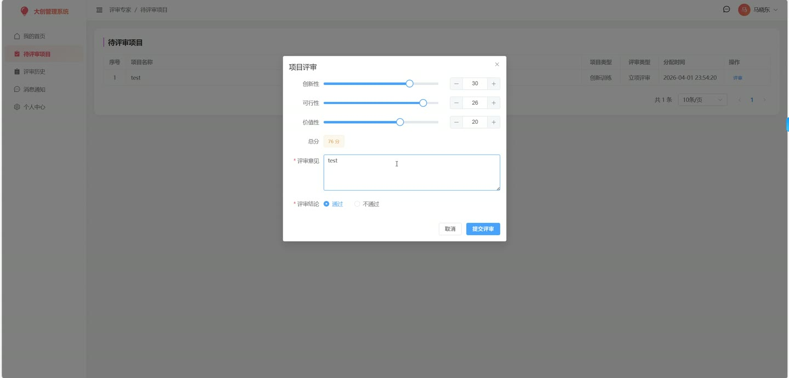
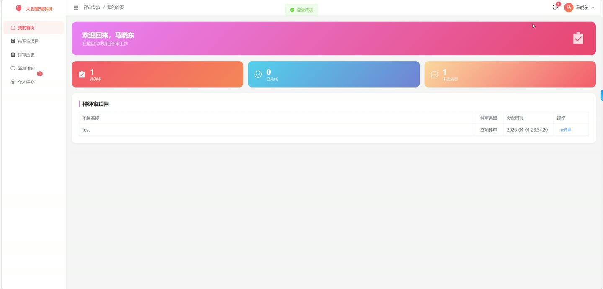
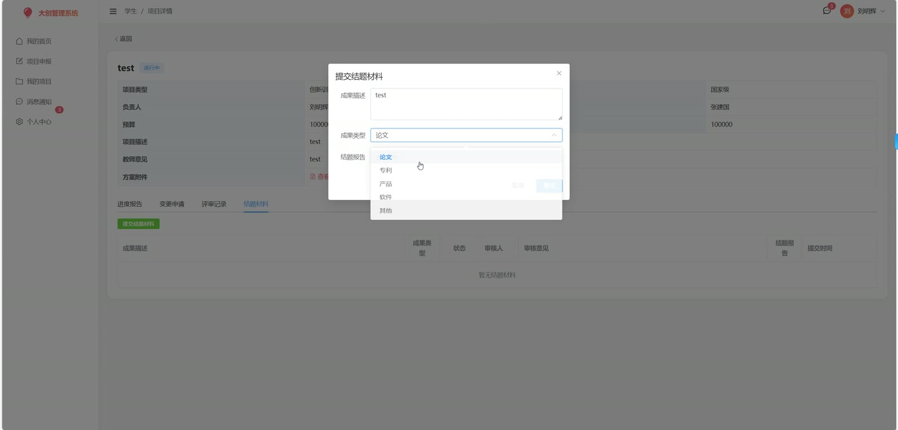
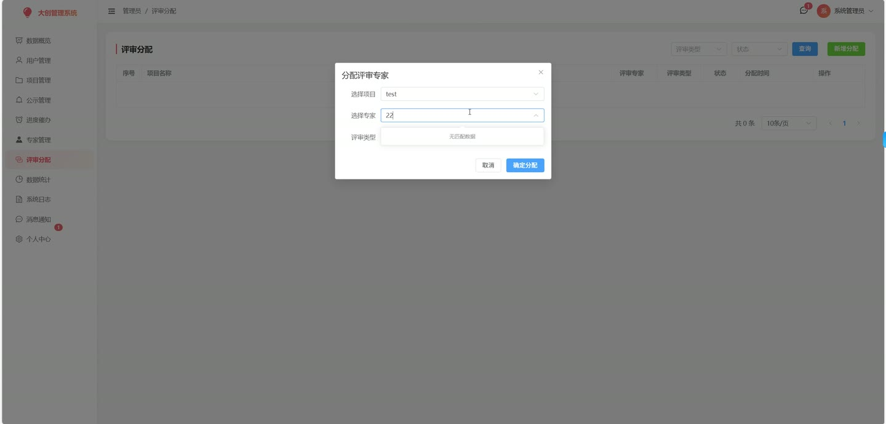
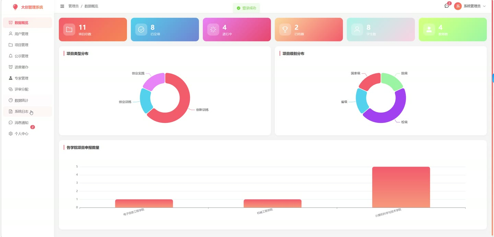

# (附文档)Springboot3+Vue3+MySQL 高校大创项目管理系统

**技术栈**：Springboot3、Vue3、MySQL

### 系统简介

本系统是一套基于 Spring Boot 3 + Vue 3 + MySQL 的高校大创项目管理系统，采用前后端分离架构，支持多角色协同管理。系统涵盖项目申报、教师审核、专家评审、进度管理、变更申请、结题验收、公示发布等完整业务流程，适用于高校创新创业项目全生命周期管理。系统内置管理员、学生、指导教师、评审专家四种角色。
 
### 核心功能
 
### 普通用户端

 
- 用户注册（仅学生角色）与登录，支持密码修改 
- 查看个人通知列表，支持分页查询 
- 标记单条通知为已读，或一键全部标记为已读 
- 获取未读通知数量 
- 查看立项公示项目列表（公开访问，无需登录） 
- 查看验收结果公示项目列表（公开访问，无需登录） 
- 查看公示项目的详细信息和结题材料（公开访问） 
- 查看公示项目的评审记录（公开访问） 
- 获取首页统计数据（项目总数、各状态数量、按学院/类型/级别统计等） 
- 文件上传，支持任意文件类型，返回文件访问路径
 
### 学生端

 
- 查看本人参与或负责的所有项目列表 
- 项目申报：填写项目名称、类型、级别、描述、计划文件、预算、指导教师，并添加项目成员（支持多成员） 
- 查看单个项目的详细信息（含项目成员列表） 
- 提交进度报告（仅限项目状态为 in_progress 时），填写报告内容并上传附件 
- 查看指定项目的所有进度报告列表（按时间倒序） 
- 提交项目变更申请（仅限项目状态为 in_progress 时），填写变更类型、变更内容 
- 查看指定项目的所有变更申请列表 
- 提交结题材料（仅限项目状态为 in_progress 时），上传结题报告、成果附件 
- 查看指定项目的所有结题材料列表 
- 查看指定项目的评审记录（含专家姓名、评分、评审意见） 
- 查看本人通知列表、未读通知数量，标记已读
 
### 指导教师端

 
- 查看本人指导的项目列表，支持按项目状态筛选和分页 
- 查看单个项目的详细信息 
- 项目初审：审核学生申报的项目，填写审核意见，通过（teacher_approved）或驳回 
- 查看待审核的进度报告列表，支持按状态筛选和分页 
- 审核进度报告：通过或驳回，填写审核意见 
- 查看待审核的变更申请列表，支持按状态筛选和分页 
- 审核变更申请：通过或驳回，填写审核意见 
- 查看本人指导项目的结题材料列表 
- 审核结题材料：通过或驳回，填写审核意见（通过后项目自动进入结题中状态） 
- 查看指定项目的评审记录 
- 查看通知列表、未读通知数量
 
### 评审专家端

 
- 查看待评审项目列表（分页），显示分配的项目名称、类型、评审类型 
- 查看已完成评审列表（分页） 
- 查看指定项目的详细信息 
- 提交评审：对项目进行创新性、可行性、价值性三项打分（每项满分），系统自动计算总分，填写评审意见 
- 查看指定项目的评审记录 
- 查看通知列表、未读通知数量
 
### 管理员端

 
- 用户管理：分页查询用户列表，支持按角色和关键词筛选 
- 新增用户：填写用户名、真实姓名、密码、角色、学院、专业等信息 
- 编辑用户信息（不可修改密码） 
- 启用/禁用用户账号 
- 重置用户密码为 123456 
- 项目管理：分页查询所有项目，支持按状态、关键词、项目类型、项目级别筛选 
- 查看项目详情 
- 更新项目状态：审批立项（需教师已审核且专家立项评审完成）、驳回、启动执行（自动设置开始日期）、设置项目等级和经费 
- 设置项目公示状态（立项公示/验收公示/取消公示） 
- 设置项目验收等级（优秀/良好/合格/不合格），自动完成结题并设置结束日期 
- 催办管理：向项目负责人和指导教师发送进度催办通知 
- 评审专家管理：分页查询专家列表，录入新专家 
- 评审分配：为项目分配评审专家，指定评审类型（立项评审/结题评审），校验项目状态匹配性 
- 查看评审分配列表，按评审类型和状态筛选 
- 查看指定项目的评审记录 
- 检查项目是否已完成指定类型的评审 
- 查看系统操作日志（分页，支持关键词搜索） 
- 查看数据统计面板：项目总数、各状态数量、按类型/级别/学院统计、用户数量统计
 
### 技术栈

 后端框架Spring Boot 3 ORMMyBatis-Plus 权限认证Spring Security + JWT（基于请求属性 userId 鉴权） 前端框架Vue 3 状态管理Vuex / Pinia 构建工具Vite 数据库MySQL 文件上传MultipartFile 本地存储 日志记录自定义 @Log 注解 + AOP
 
### 交付内容

 
- 后端完整源码 
- 前端完整源码 
- 数据库初始化脚本 
- 万字文档

## 界面展示

---

## 获取完整源码 + 万字文档

本仓库为项目介绍页。**完整前后端源码、数据库初始化脚本、万字项目文档**，请加微信 `kangkangcode`，或访问 [codekk.top](http://codekk.top) 获取。

可作课程设计 / 毕业设计参考，支持远程部署调试。